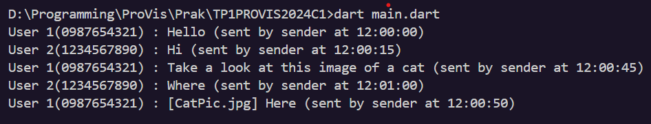

# TP1PROVIS2024C1
Program ini mensimulasikan chat diantara 2 user dimana chat biasa(text saja) akan lebih cepat terkirim daripada chat dengan attachment.
## Implementasi OOP
Program ini memiliki tiga kelas, yaitu kelas User, Chat, dan juga Attachment dimana Attachment mewarisi kelas Chat.

## Implementasi Asynchronous
Pada program simulasi ini waktu delay ditentukan oleh size dari chat, semakin besar size-nya semakin akhir/lama pula pesan terkirim

## Dokumentasi Jalannya Program
